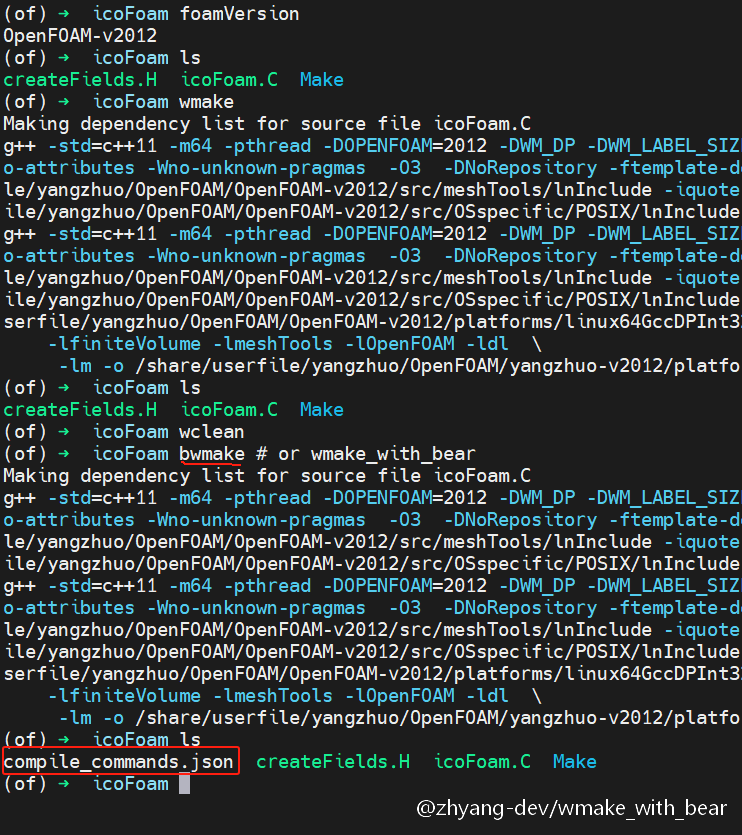
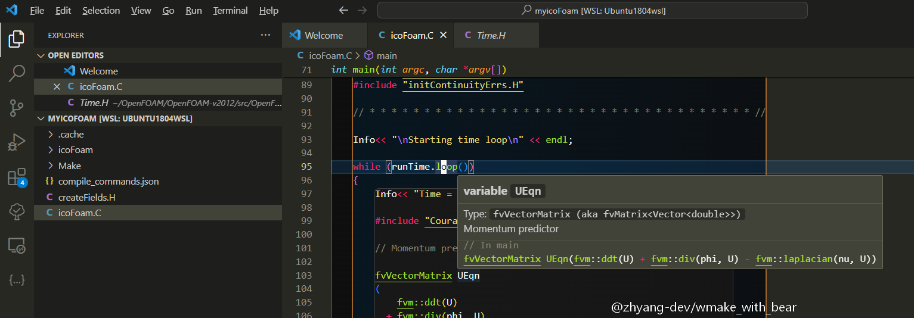

# wmake_with_bear
[中文](./README.zh_CN.md) | [English](./README.md)

## Project Description

The `compile_commands.json` file is often used to help various language servers (such as clangd, ccls, etc.) understand how to compile a project, enabling features like code navigation, completion, and analysis.

This project aims to help OpenFOAM generate `compile_commands.json`. The `bear` tool is specifically used to generate this file, as it wraps the build command `make` to capture various compilation options. Since OpenFOAM's native build tool `wmake` is a wrapper around `make`, it makes sense to combine `wmake` with `bear` to generate `compile_commands.json`.

In fact, the com version of OpenFOAM has already considered this and provides a `-with-bear` option to invoke `bear`. However, this project seeks to be more general, supporting both the com and org versions, as well as the foam-extend version. The good news is that these three main branches share some common logic in the underlying `wmake` toolchain.

## Installation and Usage
### Dependencies

This project clearly depends on Bear. You can usually install it using the system's package manager or through tools like Conda for precompiled versions. Of course, you can also compile it from source. For more details, refer to [rizsotto/Bear](https://github.com/rizsotto/Bear).

### Installation

The installation is straightforward:

```bash
# Activate your OpenFOAM environment, then clone the project and run the install script
$ git clone --depth 1 https://github.com/zhyang-dev/wmake_with_bear.git
$ cd wmake_with_bear && chmod +x install && ./install
```

### Usage

The installation command above will create a `wmake_with_bear` and alias `bwmake` in the `$WM_PROJECT_DIR/wmake` directory. To generate `compile_commands.json` in a project, use `bwmake` instead of `wmake`.

### Testing

The following tests use icoFoam as an example.

The usage of `bwmake` is basically the same as `wmake`, but `bwmake` can generate `compile_commands.json`. In OpenFOAM-v2012, using `bwmake` to compile icoFoam produces the result shown below.



Using `clangd` as the language server in VSCode, you can see that code suggestions work correctly.



Tested environments:
- OpenFOAM-v2406 on Ubuntu-24.04 with bear 3.1.3
- OpenFOAM-v2012 on Ubuntu-20.04 with bear 2.4.3
- OpenFOAM-v2012 on Ubuntu-16.04 with bear 2.1.5
- OpenFOAM-11 on Ubuntu-20.04 with bear 2.4.3
- OpenFOAM-6 on Ubuntu-18.04 with bear 2.3.11