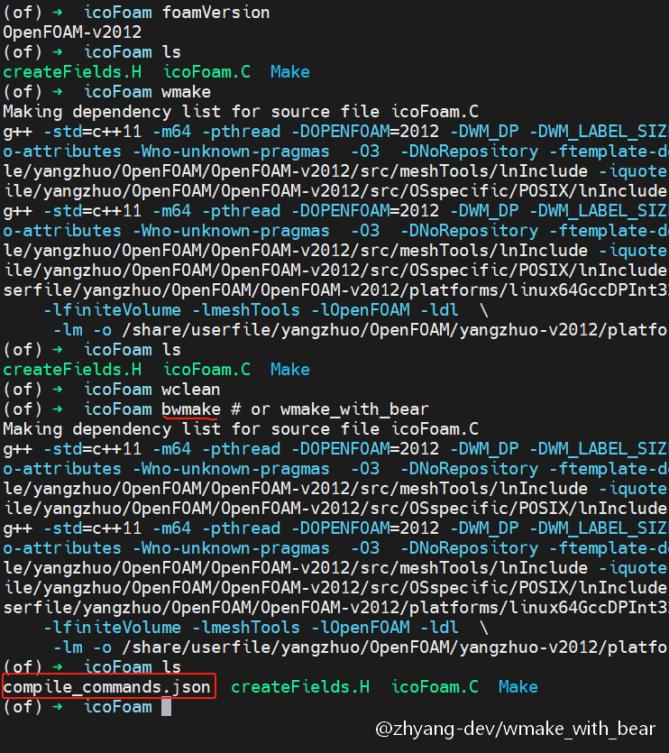
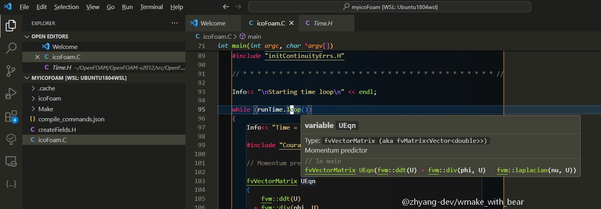

# wmake_with_bear
[中文](./README.zh_CN.md) | [English](./README.md)

## 项目说明
compile_commands.json常被用于帮助各种language server（例如常见的cland，ccls等）理解如何编译项目，以便提供代码导航、补全和分析等功能。

本项目的目标是帮助OpenFOAM项目生成compile_commands.json。bear工具专门用来生成该文件，它需要包裹构建命令make，以获取各种编译选项。而OpenFOAM原生的编译工具wmake是对make的包装，因此有道理认为wmake可以与bear结合，以生成compile_commands.json。

事实上com版的OpenFOAM发行已经考虑到了这一点，它提供了`-with-bear`选项来调用bear，但是本项目希望更加通用，同时支持com和org，甚至是foam-extend版。好消息是这三个主流分支在wmake工具链的底层逻辑上还有一定共性。

## 安装和使用

### 依赖
显然该项目依赖bear，一般可以使用系统的包管理器安装，或者通过conda之类的工具安装预编译的版本，当然也可以自行源码编译。
具体可以参考[rizsotto/Bear](https://github.com/rizsotto/Bear)

### 安装
项目的安装很简单：
```bash
$ # activate your of environment, then in any place, clone the project and run install script
$ git clone --depth 1 https://github.com/zhyang-dev/wmake_with_bear.git
$ cd wmake_with_bear && ./install
```

### 使用
上述安装命令会在`$WM_PROJECT_DIR/wmake`目录下创建一个`wmake_with_bear`以及别名`bwmake`，
这样在希望生成`compile_commands.json`的项目中，使用`bwmake`替换`wmake`就能调用wmake同时生成该json文件。

### 测试
下面以icoFoam为例测试。

bwmake的使用跟wmake使用基本相同，但是bwmake能够生成`compile_commands.json`。
在OpenFOAM-v2012中使用bwmake编译icoFoam的效果如下图所示。




在VSCode中使用clangd作为language server，可以发现能够正常代码提示。



已测试环境：
- OpenFOAM-v2406 on Ubuntu-24.04 with bear 3.1.3
- OpenFOAM-v2012 on Ubuntu-20.04 with bear 2.4.3
- OpenFOAM-v2012 on Ubuntu-16.04 with bear 2.1.5
- OpenFOAM-11 on Ubuntu-20.04 with bear 2.4.3
- OpenFOAM-6 on Ubuntu-18.04 with bear 2.3.11
